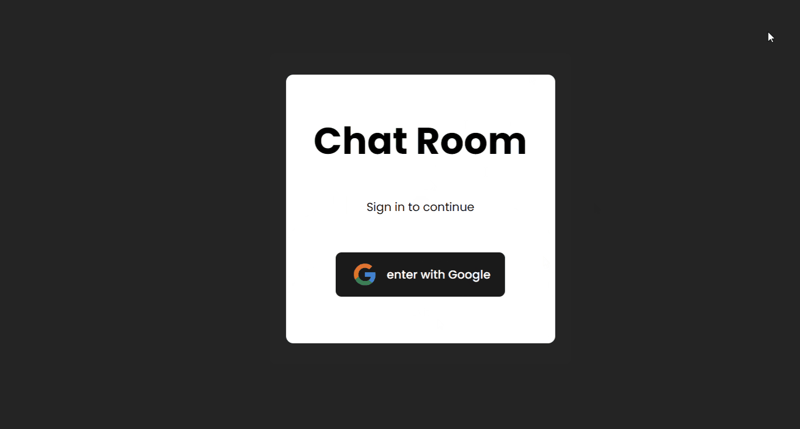

<h1> CHAT APP </h1>

**Developing a multi-room chat application**

Bu proje, birden fazla odada sohbet edebilme özelliği sunan bir uygulamadır. React ve Firebase kullanılarak geliştirilmiştir.

<h2> Used technologies </h2>

- **React**: Kullanıcı arayüzü oluşturmak için.
- **Firebase**: Gerçek zamanlı veritabanı ve kimlik doğrulama işlemleri için.
- **Vite**: Hızlı geliştirme sunucusu ve build işlemleri için.

<h2> Özellikler </h2>

Çoklu sohbet odası desteği
Gerçek zamanlı mesajlaşma
Firebase ile kullanıcı kimlik doğrulama

<h4>Geliştirici Notları:</h4>

Proje, React ile modüler ve yeniden kullanılabilir bir yapı oluşturularak geliştirilmiştir. Firebase ile gerçek zamanlı veritabanı ve kimlik doğrulama entegrasyonu sağlanmıştır. Vite sayesinde hızlı geliştirme ortamı ve optimize edilmiş build işlemleri gerçekleştirilmektedir...
(Firebaseden silinmiş olabilir)

<h2> Proje Kurulumu  </h2>

Projeyi yerel bilgisayarınıza klonladıktan sonra aşağıdaki adımları izleyerek çalıştırabilirsiniz:

### Gerekli Bağımlılıkları Kurun:
npm install

### Geliştirme Ortamını Başlatın:
npm run dev

<h2> Screen Gif </h2>

